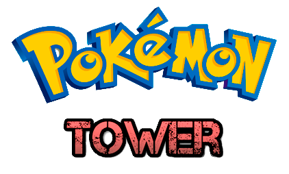
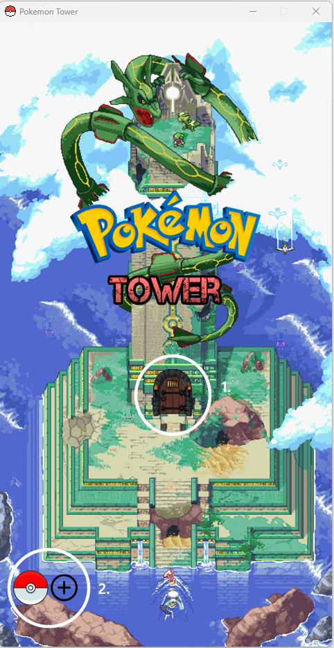
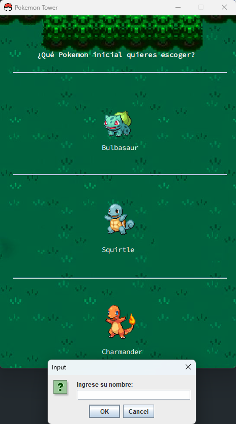
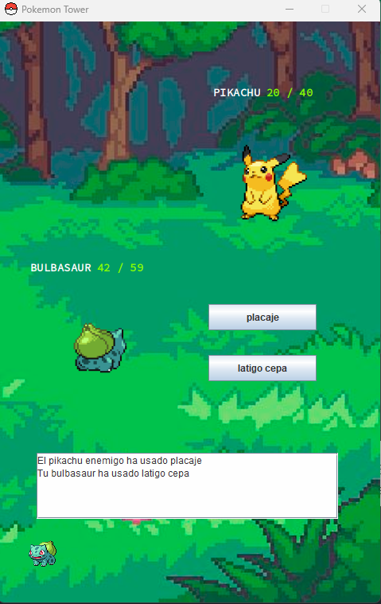
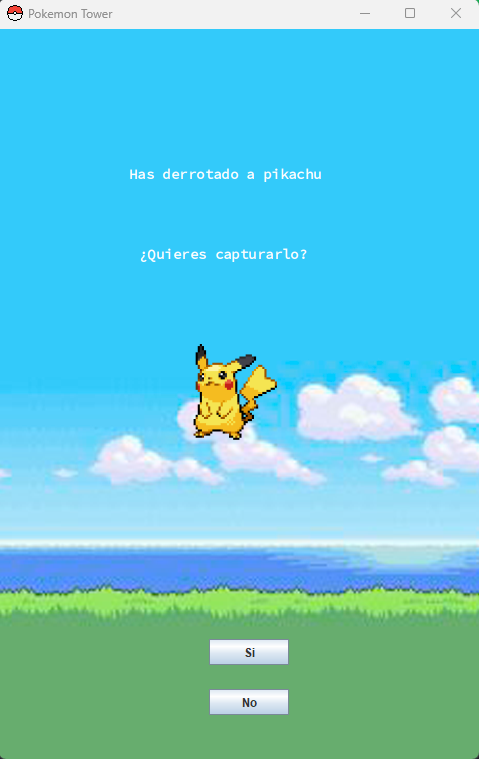
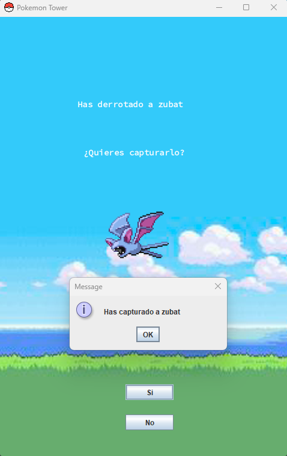
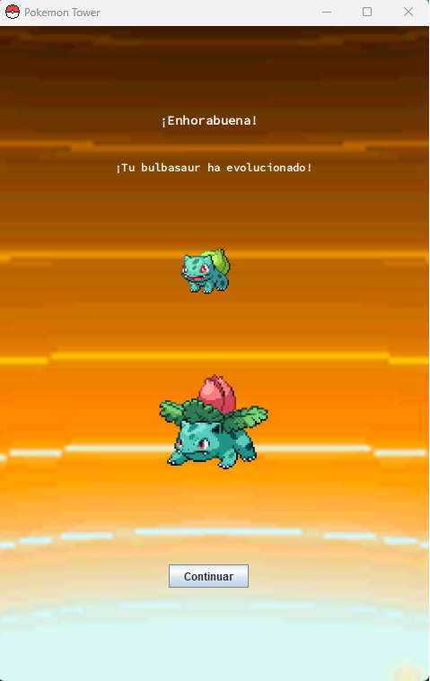
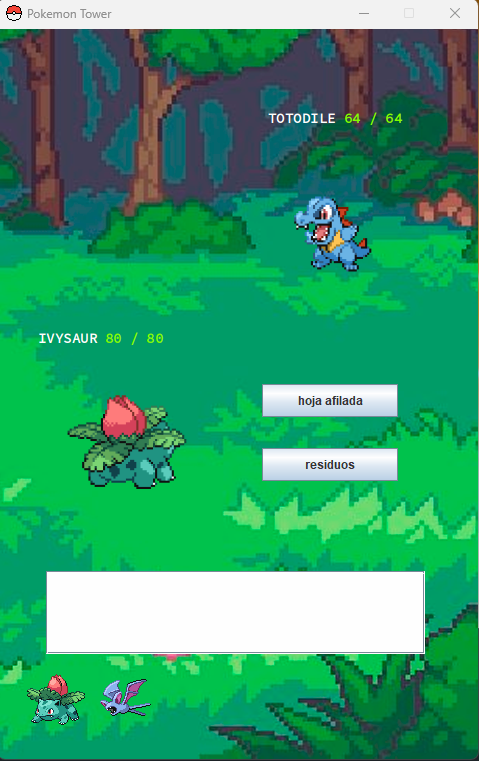

<b>Pokemon Tower</b> es un juego de combates Pokemon, donde tendrás que superar varios niveles para llegar hasta la cima y proclamarte como campeón.

Es mi primer proyecto en Java y mi proyecto final para el curso de DAW.

Para acceder directamente a la instalación, pulse [aquí](#instalación)

----------------------

## Funcionamiento del juego

Al iniciar la aplicación, entraremos a la siguiente ventana:

1. Puerta que nos da acceso a la torre, y así a comenzar el juego.
2. Menú para importar Pokemon. Desde un fichero, línea por línea, se leen los datos escritos y se utilizan para la creación de nuevos Pokemon en nuestra base de datos. El formato establecido se especifica en el menú. Los Pokemon importados no aparecerán en nuestro juego, Pero quedarán recogidos [aquí](PokemonTower/src/import/importeds.md)

Una vez que pulsemos la puerta de acceso a la torre, nos aparecen los Pokemon iniciales y un pop-up para introducir nuestro nombre de usuario, vital para ciertas mecánicas del juego:

Es importante saber que el usuario introducido se almacenará en nuestra base de datos si no existe, y si existe, obtendrá el número de victorias que ya ha acumulado el usuario.

Tras introducir nuestro nombre de usuario y elegir uno de los Pokemon iniciales, comenzará nuestro primer combate.

El Pokemon generado para combatir contra nosotros es aleatorio. En nuestra base de datos figuran una gran variedad de Pokemon, teniendo cada uno de ellos un nivel de poder.

Al comenzar, el nivel de poder es 1, por lo que este Pikachu es un pokemon aleatoriamente generado entre todos los que tienen poder 1.

Cada Pokemon posee 2 ataques diferentes, teniendo cada ataque la potencia real de los juegos de Pokemon, y cada Pokemon tiene estadísticas reales. Es importante recalcar que en este juego no existe la tabla de tipos.

Al ejecutar uno de los ataques de nuestro Pokemon, el enemigo responderá con uno de sus ataques, y el turno quedará reflejado en el "Text Area" situada en la parte inferior. Cada vez que se ejecutan movimientos, la vida de ambos Pokemon descenderá.

Cuando la vida de un Pokemon se encuentra por debajo del 50%, su color cambia a amarillo, y cuando se encuentra por debajo del 33%, cambia a rojo.

Debajo del text area, podemos ver todos los Pokemon en nuestro equipo. Ahora vemos esto con más detalle. Ahora, vamos a derrotar a Pikachu.

Cuando derrotamos a un Pokemon, tenemos la posibilidad de capturarlo para añadirlo a nuestro equipo. 

La probabilidad inicial de captura es de 40%. Si decidimos capturarlo, la probabilidad seguirá siendo de 40%, mientras que, por cada Pokemon que decidamos no capturar, nuestra probabilidad de captura subirá un 10%. La probabilidad vuelve a su valor por defecto al intentar capturar a un Pokemon, sea capturado o no.

Voy a decidir no capturarlo y pasar al siguiente nivel.

En el nivel 2, el Pokemon que ha aparecido es un Zubat. He decidido capturarlo.

Tras 2 niveles superados, si el primer Pokemon de nuestro equipo tiene evolución, este evolucionará. Si no tuviese evolución, lo haría el siguiente Pokemon de nuestro equipo, si es que este Pokemon ya ha superado 2 niveles.

Tras haber capturado un nuevo Pokemon y haber evolucionado otro, vemos como nuestro equipo Pokemon ha cambiado, actualizando sus sprites.

Nuestro Bulbasaur ha evolucionado a Ivysaur, aumentando sus estadísticas de combate y actualizando sus movimientos a otros más fuertes.

----------------

La mecánica del juego es la misma hasta superar todos los niveles. Si todos tus Pokemon son derrotados, puedes volver a intentarlo desde el inicio.

Una vez completas la torre y te proclamas como campeón, se generará un archivo Markdown guardando tus resultados, uno por cada vez que se supera el juego, como [este](PokemonTower/src/victoryLogs/mpacheco1.md)

Para los jugadores que hayan completado la torre 3 veces, se desbloqueará un nuevo nivel aún más desafiante, así que si quieres descubrirlo, ¡no dudes en jugarlo!

----------------

## Instalación

1. Descargar o clonar el repositorio.
2. Acceder a "PokemonTower/src/bd" e importar el fichero <b>"pokemontower.sql"</b> a <b>Xampp</b>.
3. Abrir el proyecto desde NetBeans o Eclipse
4. Modificar las variables del inicio del archivo "PokemonTower/src/bd/conexion.java" para que se adapten a tu equipo. <b>Introducir el puerto correcto en la URL y modificar user y pass.</b>
5. ¡Ejecutar el proyecto y a disfrutar del juego!